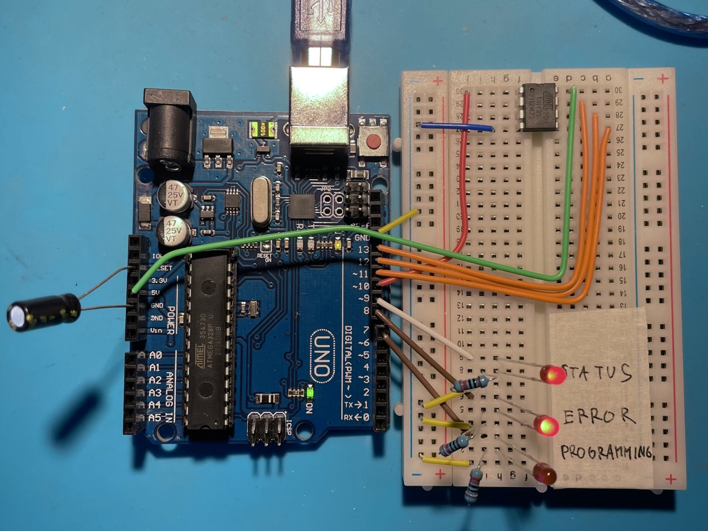

# The Brick Lamp Firmware

Written in rust for the ATTiny85 microcontroller.

## Building a firmware programmer with Arduino UNO

I used the Arduino UNO with the [Arduino as ISP](https://docs.arduino.cc/learn/communication/spi/) firmware as the programmer. Wired it on a breadboard as described. **Importantly, I had to put a 10uF capacitor between the `RESET` and `GND` pins (negative leg to `GND`) _on the UNO_.** Otherwise `avrdude` would report cryptic "protocol errors".

.

## Flashing the Firmware

1. Install dependencies: `brew install avr-gcc avf-libc avrdude rave-dude`
2. This firmware assumes the ATTiny is configured with 8MHz clock. By default it uses 1MHz. Configure it to use the 8MHz internal clock: `avrdude -v -p attiny85 -c arduino_as_isp -P /dev/cu.usbmodem101 -b 19200 -e -U efuse:w:0xff:m -U hfuse:w:0xdf:m -U lfuse:w:0xe2:m`. Needs to be done just once per chip.
3. Build and flash the firmware: `cargo run`. Internally, it uses `ravedude` which in turn uses `avrdude` to flash the built executable.
   - If you get a `OS error: cannot open port /dev/cu.usbmodem1101: No such file or directory` you just need to fix the path in `Ravedude.toml`

### References

- https://docs.arduino.cc/built-in-examples/arduino-isp/ArduinoISP/
- http://highlowtech.org/?p=1695
- https://highlowtech.org/?p=1706
- https://www.arduinoslovakia.eu/page/stmievac-led-pasika-pomocou-attiny85
- https://www.arduinoslovakia.eu/page/nelinearna-citlivost-ludskeho-oka
- https://www.mauroalfieri.it/elettronica/rotary-encoder-attiny85-neopixel.html
- https://thewanderingengineer.com/2014/08/11/rotary-encoder-on-the-attiny85-part-2/

## License

Licensed under [WTFPL](https://en.wikipedia.org/wiki/WTFPL).
